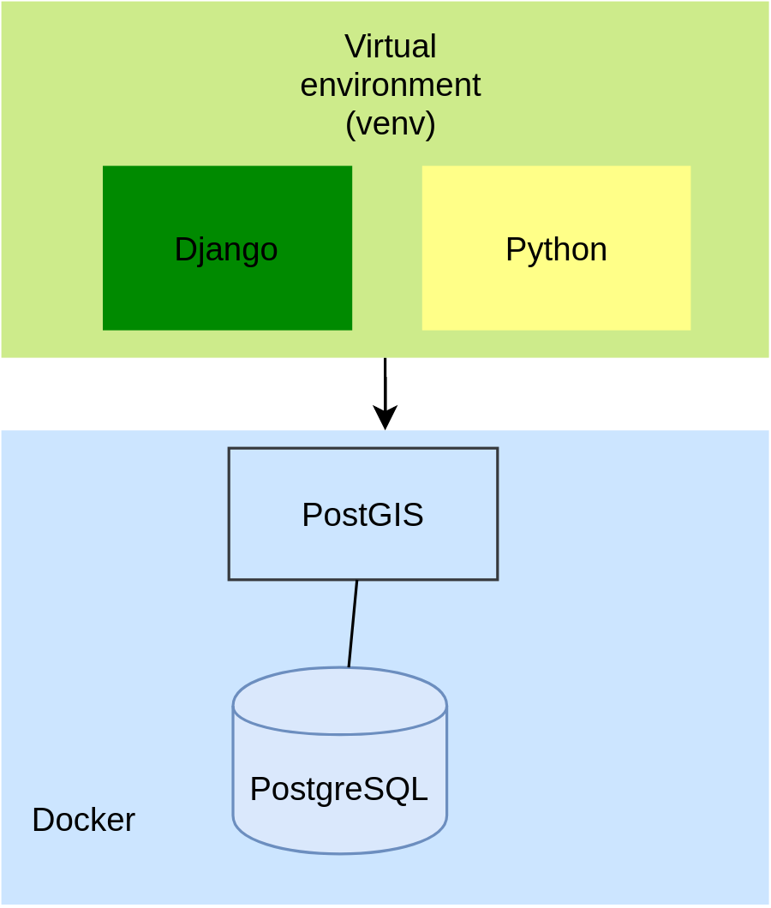

# GeoDjango

## The Tools used:

- You’ll be using the following tools to develop your nearby shops web application:

- The Python programming language
- The Django web framework
- The PostgreSQL database for persisting data
- The PostGIS extension for supporting spatial features in the PostgreSQL database pip for installing dependencies
- The venv module for managing a virtual environment
- Docker for installing PostgreSQL and PostGIS

